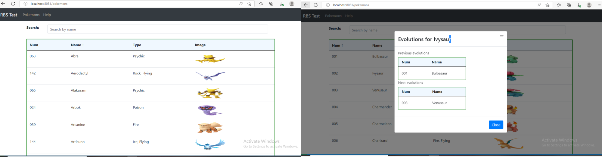

# React.js App for RBS test with React Router & Axios

Build a React.js Application to consume remote data, display data with Router, Axios & Bootstrap.

React RBS test Application in that:
- The remote data is displyed in a tabular format, using react libraries.
- Each record contains the ‘num’, ‘name’ and ‘type’ properties in the table.
- Each record displays the associated image in the table.
- The table data is ordered alphabetically on the ‘name’ property, in ascending order.
- There is a Search bar for finding pokemons by name.
- When a user clicks on a table row, the application displays them with additional 
  information(previous and next evolutions) on the selected entry.
- User can perform ordering of columns(num, name) in ascending/descending order.



For data resources, please visit:
> Remote data location: https://raw.githubusercontent.com/Biuni/PokemonGO-Pokedex/master/pokedex.json)

Git location:
> [](https://github.com/MKR1979/RBSTest/)


### Set port
.env
```
PORT=8081
```

## Project setup

In the project directory, you can run:

```
npm install
# or
yarn install
```

or

### Compiles and hot-reloads for development

```
npm start
# or
yarn start
```

Open [http://localhost:8081](http://localhost:8081) to view it in the browser.

The page will reload if you make edits.
